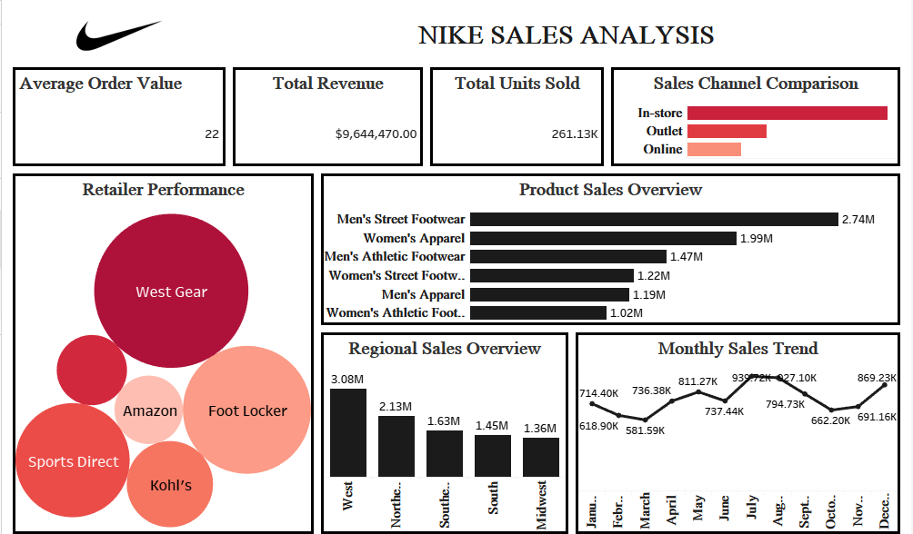

# Nike Sales Analysis

## Project Overview

This project analyzes Nike sales performance across products, retailers, sales channels, and regions. The interactive Tableau dashboard provides insights into revenue, units sold, product demand, retailer performance, and monthly sales trends to support data-driven business decisions.

---

## Business Problem

This analysis aims to answer the following business questions:

- Which Nike products generate the highest revenue?
- Which retailers contribute the most sales?
- Which sales channels perform best?
- How do sales vary across regions?
- What are the monthly sales trends?
- What is the average order value?

---

## Objectives

- Analyze overall sales performance.
- Evaluate retailer performance.
- Identify top-selling products.
- Compare sales channels.
- Monitor monthly sales trends.
- Build an interactive business dashboard.

---

## Tools Used

-Microsoft Excel – Data Cleaning and Analysis
- Python – Data Preparation
- Tableau – Dashboard Development

---

## Dashboard Features

### Key KPIs

- Average Order Value (AOV)
- Total Revenue
- Total Units Sold

### Visualizations

- Retailer Performance
- Product Sales Overview
- Sales Channel Comparison
- Regional Sales Overview
- Monthly Sales Trend

---

## Key Insights

- Men's Street Footwear generated the highest revenue.
- West Gear was the highest-performing retailer.
- In-store sales outperformed both online and outlet channels.
- Sales peaked during the middle of the year before fluctuating toward year-end.
- The West region generated the highest overall sales.

---

## Business Recommendations

- Increase inventory for high-demand product lines.
- Strengthen partnerships with top-performing retailers.
- Invest further in high-performing sales channels.
- Develop strategies to improve sales in lower-performing regions.
- Use seasonal sales trends to improve demand forecasting.

---

## Skills Demonstrated

- Data Cleaning
- SQL Querying
- Tableau
- Business Intelligence
- KPI Reporting
- Sales Analytics
- Retail Analytics
- Data Visualization

---

## Repository Contents

```
Nike-Sales-Analysis
│
├── README.md
├── Nike Sales Analysis.twbx
├── SQL Queries.sql
├── Dataset.xlsx
```

---

## Dashboard Preview



---

## About Me

I am an aspiring Data Analyst passionate about transforming raw data into meaningful business insights through SQL, Excel, Power BI, and Tableau. I enjoy creating interactive dashboards that help organizations make informed decisions.
